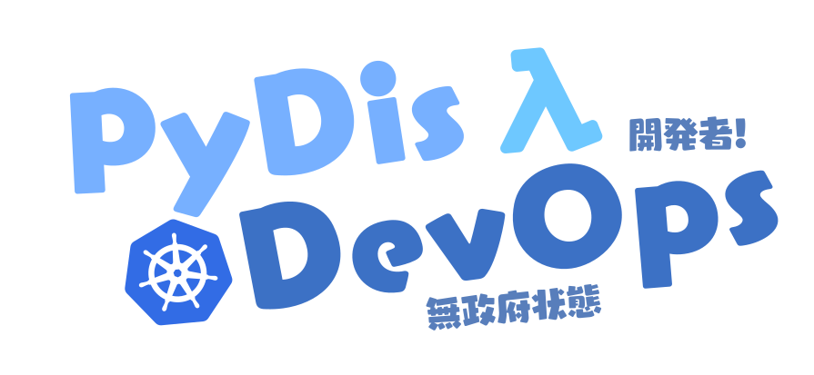

# ops-site

This is the source code for our internal service directory. It is a simple web application that lists services available to DevOps and staff team members.

## Getting Started

To get started, clone the repository and run the following commands:

```bash
npm install
npm run develop
```

## Deployment

This site automatically deploys to Netlify when changes are merged to the `main` branch.

## Contributing

If you would like to contribute to this project, please create a new branch and open a pull request.

Netlify will automatically deploy a preview of your changes to a unique URL.

## License

This project is licensed under the MIT License - see the [LICENSE](LICENSE) file for details.
